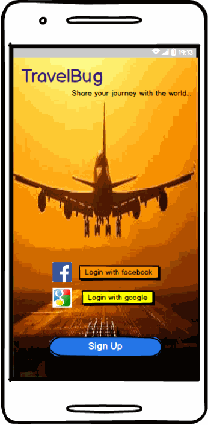

# Group Project -- TravelBug

**TravelBug** is an android app that allows a user to record their experience while taking a trip in
a way that can be shared with friends and family after/or during the trip. The app records the
user's itinerary through a trip, including pictures, videos and text snippets and creates a timeline
of trip events that can be shared with friends and family. The sharing can happen during the trip,
in which case the recipients get a constantly updated version of the events, or after the trip.

## Members:
* Oron Carty
* Pragyan Debadarshini
* Arunesh Mishra

## User stories

### Major Screens:
* Login/Register. The app allows login and register using Facebook or Google + identities.
* Timeline creation: While travelling:
   * Creation screen: User can create a new travel timeline. This is a new trip.
        * Includes ability to add destinations, start / end dates and co-travellers. 
   * User can add a picture, a video or a text to the travel timeline.
* View timeline screen: A screen that shows the travel timeline.
   * From the View Timeline screen: User can share the timeline with other users (from FB/G+).
* Stream view / Home screen: Shows all timelines.
* Sharing features: User can view any other user's shared travel timeline.
   * Stream archetype: Shared timeline gets auto updated if the other user's travel is ongoing.
   * Users can comment on the shared items.
   * Users get notified when someone shares a travel timeline with them.
* Profile screen: User's can navigate to view their own profile (auto filled from FB or G+).
   * Users can update their pictures to be different from FB/G+.
* Settings screen: Users can change their settings, delete timelines, notification options. 

### Additional Screens:
* In the timeline, users can click on other users and view their profile.
* All of the created data should be stored offline since while travelling the users might not have
  network connectivity.
    * Ability to sync as and when network is available.
    * Ability to prefer syncing over Wifi compared to cellular.
    * Automatic retries when there are network issues.
* Extended archetypes:
   * Map view: As a part of the travel timeline, a splash screen with a mapview can show the travel
     itinerary.
   * Media player: Ability to play a video or view all the pictures in a timeline.

### Database schema:
 * Relational database schema for storing the timeline data. 
   * User table: Stores information about users (including self).
    - UserId (Primary Key)
    - Username
    - Profile Image picked up from facebook
    - List of Timelines that the user owns
    - Friends: List of UserIds
   * Timeline Table:
    - Timeline Id (Primary Key)
    - List of Event objects (Chronologically)
    - UserId
   * Event Table
    - Event Types:
    - Event Id (Primary Key)
    - Picture (Bitmap/JPEG/png) or Videos
    - Text related to picture/video or simple events
    - List of Timeline Ids
    - Geolocation (Places/Lat-Long/Address with Title)
   * Relation:
    - An user can have many timelines (timelineIds)
    - An user can have many friends (other userIds)
    - A timeline can have multiple pictures (pictureIds)
   * Sharing/ownership table: Who shared/owns which timeline.
    - TBD

### Backend:
 * Parse (Heroku) based backend.

Optional 
* Ability to post pictures to instagram or Twitter including a link for others to Download and
  directly be taken into this Travel story.
* Onboarding screens: Shows the user how to register, create, share and view travel timelines.
* Chat interface: Ability to chat with everyone travelling as part of the same timeline, including
  real-time location.

## Database Schema:
* User:
   * UserId (Primary Key)
   * Username
   * Profile Image picked up from facebook
   * List of Timelines that the user owns
   * Friends: List of UserIds
* Timeline
   * Timeline Id (Primary Key)
   * List of Event objects
   * UserId
* Event Objects
   * Event Types
   * Event Id (Primary Key)
   * Picture (Bitmap/JPEG/png) or Videos
   * Text related to picture/video or simple events
   * List of Timeline Ids
   * Geolocation (Places/Lat-Long/Address with Title)

* Relation:
   * An user can have many timelines (timelineIds)
   * An user can have many friends (other userIds)
   * A timeline can have multiple pictures (pictureIds)
 
## Wireframes GIF:

Here is a set of wireframes  created using Balsamiq.
